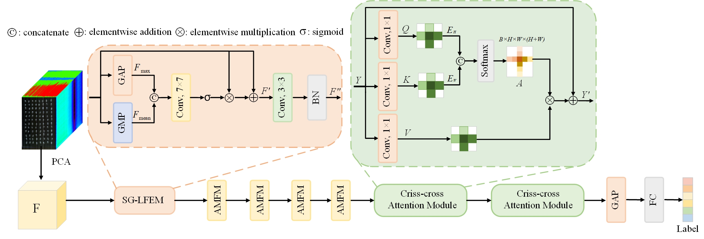

# SSANet
Pytorch code for [VIS-NIR-SWIR Hyperspectral Wheat Variety Identification: A Spectral-Spatial Synergy
Attention Network and A Benchmark Dataset](), Computers and Electronics in Agriculture.

[Yanan Qiang](), Huamei Xin, Xuquan Wang, Jiande Sun, and Kai Zhang.

## Citation
If you find this work useful for your research, please cite: 
```

```

## Introduction
In this paper, we constructe the VIS-NIR-SWIR hyperspectral wheat dataset(VNS-HW) with bands ranging from 400 to 1700 nm. Meanwhile, we propose SSANet, a novel framework for wheat seed classification. It comprehensively extracts spatial-spectral features from seeds and dynamically fuses them to enhance discriminative capability.



## Highlight
- VNS-HW hyperspectral wheat seed dataset, with wavelengths ranging from 400 nm to 1700 nm.
- An end-to-end network is designed for wheat seed identification.
- The multiscale AMFM with the lightweight CCF enables dynamic fusion of spectral–spatial features.

## Code
### Prerequisite
1. Create python environment (Recommend to use [Anaconda](https://www.anaconda.com/));
2. Install python packages.
```python3
  pip install -r requirements.txt
```
### Prepare datasets
1. Place the downloaded VNS-HW dataset in the "data" folder;
2. The dataset is split into training, testing, and validation sets in a ratio of 8:1:1. 
3. --epochs 100 --lr 1e-3 --patch size 65×65. 
### Training and Testing
Run <strong>train.py</strong> and <strong>teat.py</strong> for training and validation to obtain OA, AA, Kappa, classification accuracy for each category, and confusion matrix.


